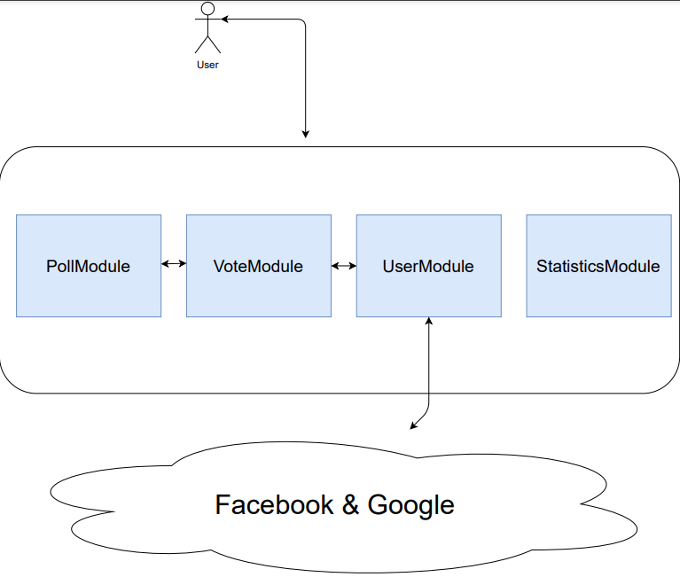
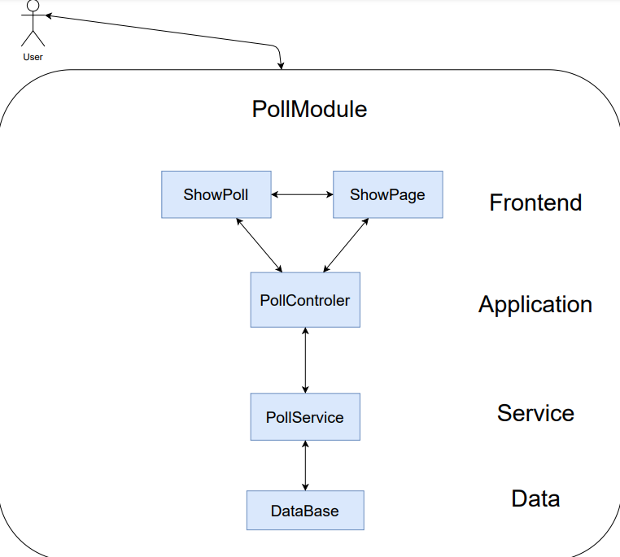
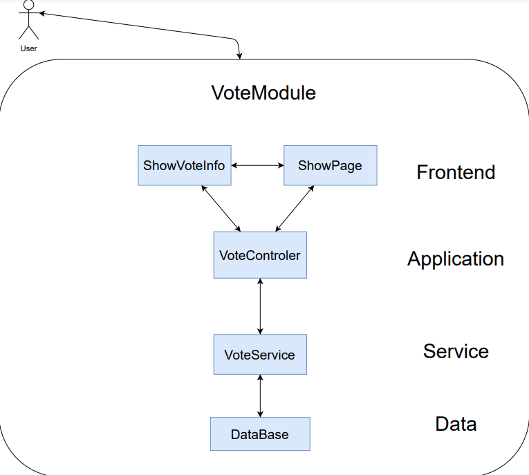
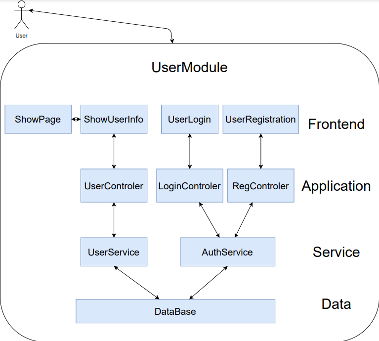
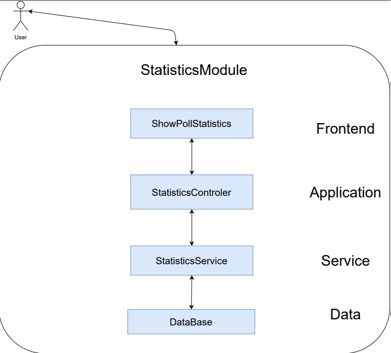

# HotPoll
Platform for hottest polls. Created in Java and React/Js.
## Table of contents
* [General info](#general-info)
* [Technologies](#technologies)
* [Setup](#setup)

## General info
HotPoll is a voting platform inspired by Reditt and Twitter. The main goal of this app is to quickly share polls all around the world. It also allows to vote and check whether your side of conflict is winning :)
	
## Technologies
Project is created with:
* Jenkins version: 2.277.1
* Nexus version: OSS 3.30.0-01
* Spring boot version: 2.4.4
* Java version: 8
* Node version: v15.11.0
* npm version: 7.6.0
* Maven frontend plugin version: 1.6
* Junit version: 4.13.2
* JaCoCo maven version: 0.8.6
* Maven resources plugin version: 3.2.0
* Docker
* InteliJ Idea
* MongoDB

	
## Setup
To run this project, you just need to type:

```
$ ./mvnw clean install
$ ./mvnw spring-boot:run
```

## Architecture summary

Architecure seen from modules perspective.



### Modules:
#### PollModule



#### VoteModule



#### UserModule



#### StatisticsModule



## Tutorials
### Frontend
* [Tutorial 1](https://youtu.be/4UZrsTqkcW4)
* [Tutorial 2](https://youtu.be/a_7Z7C_JCyo)
* [Tutorial 3](https://youtu.be/ZmVBCpefQe8)
### Backend
* [Tutorial 4](https://www.youtube.com/watch?v=RZ8A2Jnxgr4&ab_channel=DevinJapan)
* [Tutorial 5](https://www.youtube.com/watch?v=DKlTBBuc32c&t=10491s&ab_channel=freeCodeCamp.org)
* [Tutorial 6](https://www.youtube.com/watch?v=9TX5LOInPIQ&t=155s&ab_channel=ValaxyTechnologies)
* [Tutorial 7](https://www.youtube.com/watch?v=9SGDpanrc8U&ab_channel=Amigoscode)
### Utility
* [Tutorial 8](https://medium.com/@dave_lunny/sane-github-labels-c5d2e6004b63)
* [Tutorial 9](https://herbertograca.com/2019/08/12/documenting-software-architecture/)
